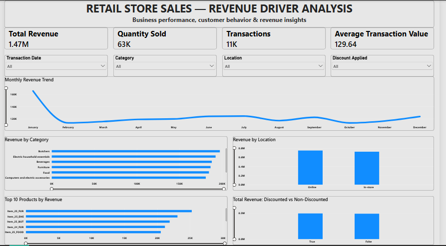

# Retail Store Sales Analysis using Python

## Project Overview

This project analyzes retail transaction data using Python to identify key revenue drivers, understand sales patterns, and generate business insights that can support management decision-making.

The analysis combines data cleaning, exploratory analysis, business-question development, and a Power BI dashboard to communicate the findings.

## Business Objective

The objective is to understand where revenue comes from and what factors contribute to differences in sales performance.

Key questions include:

- Which categories and products generate the most revenue?
- How do price and quantity sold influence revenue?
- How do sales vary over time and across locations?
- Do discounts appear to influence sales performance?

## Tools & Data Preparation

**Tools:** Python (Pandas, NumPy, Matplotlib), Power BI

The raw dataset contained 12,575 transactions. After addressing missing values and other data-quality issues, 11,362 records were retained for analysis.

The cleaned dataset was then used for exploratory analysis and dashboard development.

## Key Findings

- **Butchers** generated the highest category revenue.
- Higher revenue was not always associated with the highest quantity sold, highlighting the role of pricing and product mix.
- **Item_25_FUR** was the highest-revenue individual product.
- Revenue varied considerably across months, with noticeable changes in the monthly sales trend.
- Discounted and non-discounted transactions showed differences in sales volume and revenue, but discounts alone did not explain overall revenue performance.

## Recommendations

- Monitor high-performing categories and products to support inventory and sales planning.
- Evaluate pricing and product mix alongside sales volume when assessing category performance.
- Review discount strategies using both revenue and sales-volume measures rather than volume alone.
- Collect additional profitability and customer-level data to support deeper analysis.

## Dashboard

The Power BI dashboard provides an interactive view of:

- Revenue and sales KPIs
- Monthly revenue trends
- Revenue by category and location
- Top products by revenue
- Discounted vs. non-discounted performance

### Dashboard Preview

Additional interactive views:

- [Category Filter](visuals/02_dashboard_category_filter.png)
- [Discount Filter](visuals/03_dashboard_discount_filter.png)
- [Location Filter](visuals/04_dashboard_location_filter.png)

## Limitations
- The dataset does not provide sufficient information to measure profitability or profit margins.
- Customer behavior analysis is limited by the available customer-level information.
- Additional operational data such as inventory, costs, promotions, and marketing activity would enable deeper investigation of revenue drivers.

# Author

## Valentine Kimotho
